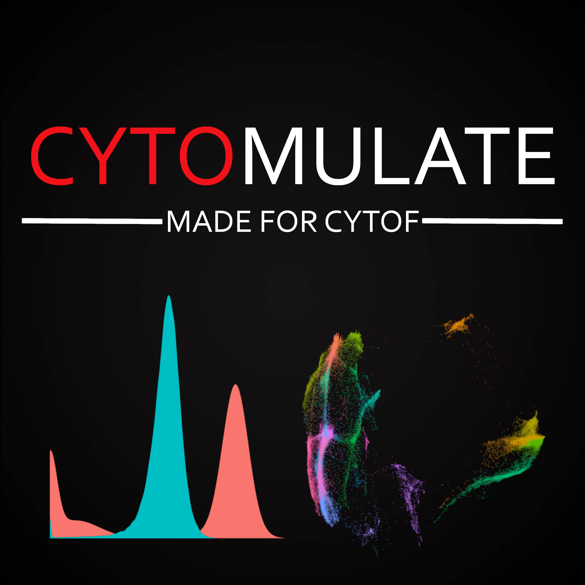

|

##############################################
Cytomulate: Your Choice of CyTOF Simulation
##############################################

Cytomulate is a package to simulation realistic data for Mass Cytometry or Cytometry by Time-of-Flight (CyTOF).
We strive to achieve both model-based and real-data-based simulation as solutions to benchmarking,
method validation, prototyping, and more.

When in doubt, Cytomulate it!

.. toctree::
   :maxdepth: 1
   :caption: Getting Started

   installation
   quickstart

.. toctree::
   :maxdepth: 1
   :caption: Tutorial

   tutorial/creation_mode
   tutorial/emulation_mode
   tutorial/visualization

.. toctree::
   :maxdepth: 1
   :caption: Technical Details

.. toctree::
   :maxdepth: 1
   :caption: Development

   change/contribution
   change/build
   change/development
   change/index
   license

.. toctree::
   :maxdepth: 1
   :caption: Full API Reference

   documentation/index

.. toctree::
   :maxdepth: 1
   :caption: Resources
   :hidden:

   Dr. Xinlei (Shery) Wang <https://people.smu.edu/swang/>
   Dr. Tao Wang <https://qbrc.swmed.edu/labs/wanglab/aboutpi.php>
   DBAI <https://dbai.biohpc.swmed.edu/>
   GitHub <https://github.com/kevin931/cytomulate/>

***********************
Resources
***********************

For more resources on our labs, collaborators, and related projects, please visit the following:

   * `Dr. Xinlei (Shery) Wang faculty page <https://people.smu.edu/swang/>`_
   * `Dr. Tao Wang Lab <https://qbrc.swmed.edu/labs/wanglab/aboutpi.php>`_
   * `Database for Actionable Immunology (DBAI) for more computational immunology-related tools <https://dbai.biohpc.swmed.edu/>`_

For project development and newest updates, consider visiting the following:

   * Our `Github <https://github.com/kevin931/cytomulate/>`_