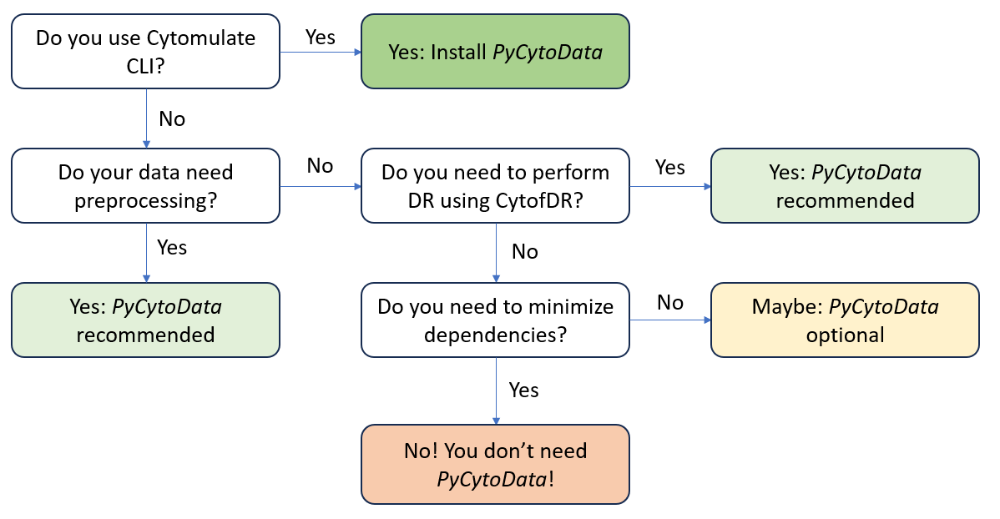

##############################
Should I install PyCytoData?
##############################

In case you haven't heard, `PyCytoData <https://pycytodata.readthedocs.io/en/latest/>`_ provides a unified
framework for analyzing CyTOF data in python. The supported workflow includes File IO, preprocessing, and
dimension reduction and visualization via CytofDR. While we believe in the future of PyCytoData, we recognize
that many people prefer a leaner package without the baggage of an ecosystem. Thus, we kindly made ``PyCytoData``
to only those who need it. In this tutorial, we walk you through whether you need to install ``PyCytoData``
and help you make the best decisions. 

------------------------------

*********************
Decision at a Glance
*********************

If you need a TLDR, we create a nifty flowchart for you to follow. At each step, ask yourself the question
and you will arrive at a conclusion. We want to emphasize that currently only the Cytomulate CLI strictly
requires ``PyCytoData`` because we don't want to maintain two branches of the same IO code. For all other
workflows, you can judge the necessity of Cytomulate yourself.

-----------------------------------

*****************************
How is PyCytoData optional?
*****************************

Currently, we need ``PyCytoData`` for two functionalities:

- The Cytomulate CLI
- Outputting to a PyCytoData object

For the former, we require ``PyCytoData`` because we rely on its File IO operations so that we don't have
reinvent a great module. For the latter, users have the option to use the ``sample_to_pycytodata`` method
or just the regular ``sample`` method. In the case that ``PyCytoData`` is not installed, user can have
NumPy arrays returned instead. As you may see, we do not rely on ``PyCytoData`` for the core model and
estimation procedures. ``PyCytoData`` is rather just a convenience feature for those who need it.

In terms of implementation, we check whether ``PyCytoData`` is importable at the beginning. If not, no
``ImportError`` is raised until absolutely necessary. This means that unless users explicitly call
``smaple_to_pycytodata`` without a proper installation, we do not complain! Of course, this implementation
has its downsides: namely, it can surprise those who are not aware of the optional dependency. We will
revisit this in the future.

***************************************
What are added benefits of PyCytoData?
***************************************

The main reason to use ``PyCytoData`` is its convenience. Specifically, it can handle batches, metadata,
and working with expression matrices easily. For those who want a wrapper around arrays, we believe that
``PyCytoData`` is a good fit. Of course, let's not forget the File IO capabilities and downstream integration
with CytofDR.

On the note of downstream analyses, ``PyCytoData`` is being actively developed. So, there will be some neat
features coming in the futrue when we add more tools and integrate more libraries.

***********************************************
Should I skip PyCytoData for CytofDR directly?
***********************************************

If you are asking this question, then **YES**! The ``CytofDR`` package provides a more complete set of
tools for benchmarking and performing DR in CyTOF. While ``PyCytoData`` can have workarounds to allow
these functionalities, we recommend using ``CytofDR`` directly. However, you are always welcomed to
install ``PyCytoData`` to manage other aspects of the CyTOF workflow.

