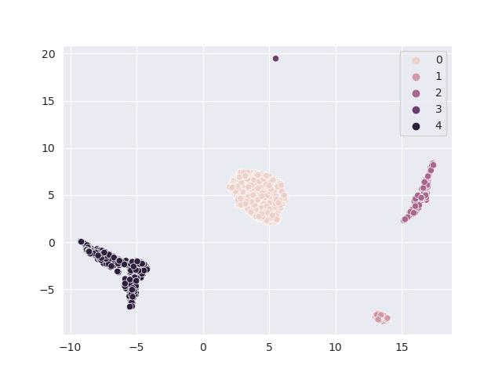

#############################
Model and Data Visualization
#############################

Visualizations are important: we don't know much without visualizing our data. In
our package, we offer two ways of visualizations: the cell type graph and the
embedding using ``PyCytoData`` and ``CytofDR``. This tutorial will walk you through
each of the method. For the purposes of simplicity, we will be relying on ``PyCytoData``
again because it's simply an amazing way of working with CyTOF datasets in Python. Of
course, if you like tinkering, you an use your own arrays and matrices.

-------------------------------

****************************
Visualizing Cell Type Graph
****************************

If you're familiar with Cytomulate, there is no secret that we use a tree to generate
cell types. Given the connected nature of cell types, this approach makes perfect
sense. For those who are unfamiliar with data structures, understanding the trees can
be quite difficult. As a result, we offer a great way to visualize the trees. To do this,
here is an example:

.. code:: python

    >>> from cytomulate import CreationCytofData
    >>> from cytomulate.cell_graph_general import GeneralCellGraph

    >>> cytof_data = CreationCytofData(n_types = 10, n_trees = 2)
    >>> cytof_data.initialize_cell_types()

    >>> cell_graph = GeneralCellGraph()
    >>> cedll_graph.graph = cytof_data.cell_graph.graph
    >>> cell_graph.visualize_graph()

This will show you two graphs with two trees and 10 cell types in total:

Of course, if you choose different parameters and change the number of cell types
or trees, you will get a different graphs. Although it is not the prettiest tree
you will ever see (we will defer this feat to national parks), you can reasonably
understand the relationships between cell types.

The same procedure applies to the emulation mode, except that you will initialize
the ``EmulationCytofData`` object and its cell types.

-------------------------------

****************************
Plot Your Embedding
****************************

A common workflow after simulation is to run dimension reduction (DR) and then visualize
the data. Fortunately, Cytomulate supports ``PyCytoData``, which in turn makes it super
easy to perform such downstream analyses.

.. note:: 

    ``PyCytoData`` is an optioanl dependency of Cytomulate. Further, to perform
    DR, you will need to install the ``CytofDR`` package, which again is an optional
    dependency to ``PyCytoData``.

To get started, we will simulate as usual, but we will need to outout the results as a
``PyCytoData`` for obvious reasons. To do this, let's start simulating first:

.. code:: python

    >>> from cytomulate import CreationCytofData

    >>> cytof_data = CreationCytofData(n_types = 5, n_trees = 2)
    >>> cytof_data.initialize_cell_types()
    >>> dataset = cytof_data.sample_to_pycytodata(n_samples = 1000)

Now that we have a PyCytoData object, we can perform dimension recution:

.. code:: python

    >>> dataset.run_dr_methods(methods=["UMAP"])
    Running UMAP
    >>> dataset.reductions.plot_reduction("UMAP", save_path="./assets/example_embedding.jpeg", hue=dataset.cell_types)

The following embedding is generated:

For more details on DR and downstream analyses, we recommend 